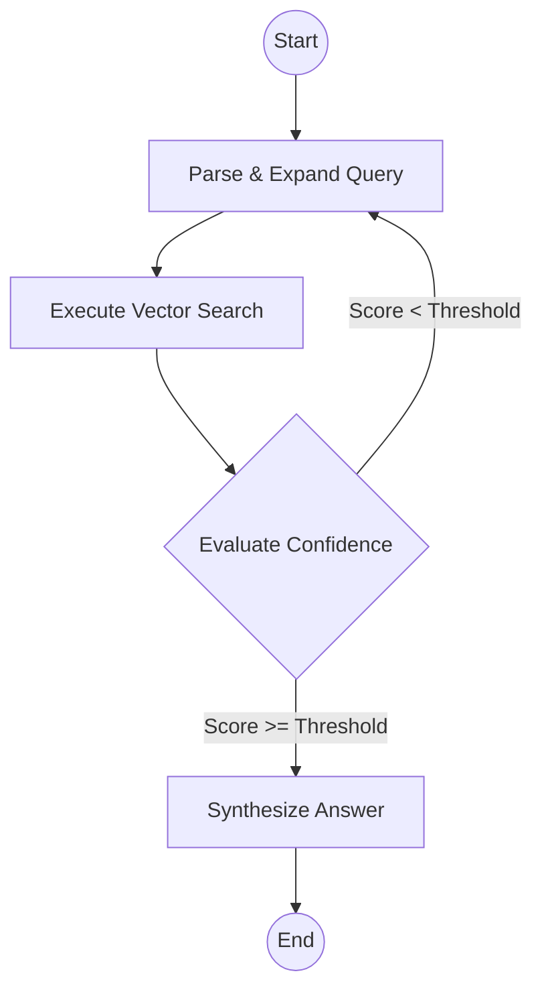

# Architecture Overview

LexAI is built on a modern, agentic Retrieval-Augmented Generation (RAG) architecture. It separates concerns into distinct layers: the API routing layer, the agentic reasoning state machine, the retrieval engine, and the vector database.

## 1. System Layers
* **API Layer (FastAPI):** Handles HTTP connections, input validation via Pydantic, and JWT-based authentication. It acts as the gateway for the frontend and external consumers.
* **Agent Layer (LangGraph):** The core "brain" of LexAI. Instead of a linear LangChain pipeline, it uses a cyclic state machine to plan searches, evaluate context, and optionally retry if the retrieved data is insufficient.
* **Retrieval Engine (DPR):** Uses a custom Dense Passage Retrieval (Bi-Encoder) model powered by ONNX Runtime for high-speed, semantic vector embeddings.
* **Data Layer (PostgreSQL + PGVector):** A relational database extended with `pgvector` to store both document metadata and high-dimensional vector embeddings, allowing for lightning-fast approximate nearest neighbor (ANN) searches.

## 2. Agentic Workflow (LangGraph State Machine)

Unlike traditional RAG, LexAI evaluates its own retrieved context before generating an answer.

### The Critic / Retry Mechanism

When the Retriever fetches documents, the Critic Node evaluates the confidence_score.

If the score is below the predefined threshold (e.g., 0.6), the Critic assumes the context is inadequate. It then triggers a retry loop, prompting the LLM to rewrite or expand the query (e.g., changing "murder" to "Qatl-i-Amd") and searches the vector database again. This significantly reduces hallucinations.

## 3. Dense Passage Retrieval (DPR) vs. BM25

Legal text often contains complex, archaic, or highly specific terminology.

**BM25 (Lexical Search):** Relies on exact keyword matches. If a user asks about "murder" but the statute uses "Qatl-i-Amd", BM25 will fail to retrieve the relevant section.

**DPR (Semantic Vector Search):** Converts both the query and the documents into dense vectors. Because the model understands semantic meaning, the vector for "murder" is mathematically close to "Qatl-i-Amd" or "homicide", allowing LexAI to bridge the lexical gap and retrieve accurate context.

## 4. Database Schema

The core table powering the PGVector retrieval is the `documents` table.

| Column Name | Type | Description |
| :--- | :--- | :--- |
| id | UUID | Primary key. |
| title | VARCHAR | Title of the parent document (e.g., "Pakistan Penal Code"). |
| source | VARCHAR | Citation source or shortcode (e.g., "PPC-1860"). |
| jurisdiction | VARCHAR | Jurisdiction code (e.g., "PK"). |
| doc_type | VARCHAR | Category (e.g., "statute", "case_law"). |
| content | TEXT | The actual text of the chunk. |
| embedding | VECTOR(768) | The 768-dimensional dense vector representation. |
| chunk_index | INT | Sequential index of the chunk within the source doc. |
| created_at | TIMESTAMPTZ | Ingestion timestamp. |
| updated_at | TIMESTAMPTZ | Last update timestamp. |

> **Note:** A unique constraint exists on `(source, chunk_index)` to prevent duplicate chunks during re-ingestion.
